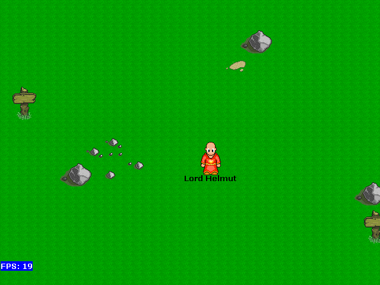



## Fantasy Tales Online v\.1\.0\.5

### Description

This is an early version of a MMORPG I am writing. It lacks any advanced coding but shows basically how to get the basics laid out for a game. It shows stuff such as creating surfaces, loading data from a file, text output and more with DirectX 7 and DirectDraw. DirectSound is also incorporated but not used often. Animations may be added in later versions.
 
### More Info
 

             |
---                |---
**Submitted On**   |2002-08-04 18:01:32
**By**             |[Lord Helmut](https://github.com/Planet-Source-Code/PSCIndex/blob/master/ByAuthor/lord-helmut.md)
**Level**          |Intermediate
**User Rating**    |4.7 (28 globes from 6 users)
**Compatibility**  |VB 6\.0
**Category**       |[Games](https://github.com/Planet-Source-Code/PSCIndex/blob/master/ByCategory/games__1-38.md)
**World**          |[Visual Basic](https://github.com/Planet-Source-Code/PSCIndex/blob/master/ByWorld/visual-basic.md)
**Archive File**   |[Fantasy\_Ta144116101020\.zip](https://github.com/Planet-Source-Code/lord-helmut-fantasy-tales-online-v-1-0-5__1-39716/archive/master.zip)

